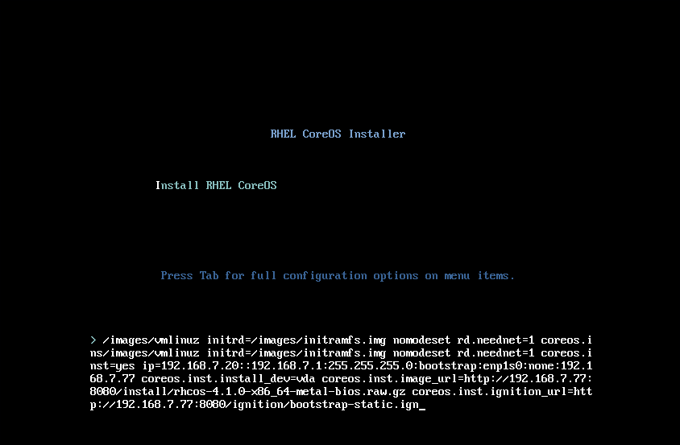

# OpenShift 4.1 Bare Metal Install Quickstart

In this blog we will go over how to get you quickly up and running with an OpenShift 4.1 Bare Metal install on pre-existing infrastructure. Although this quickstart focuses on the bare metal installer, this can also be seen as a "manual" way to install OpenShift 4.1. Moreover, this is also applicable to installing to any platform which doesn't have the ability to provide [ignition](https://coreos.com/ignition/docs/latest/) pre-boot. For more information about using this generic approach to install on untested platforms, please see this [knowledge base article](https://access.redhat.com/articles/4207611).

## Introduction

Openshift 4 introduces a new way of installing the platform that is automated, reliable, and repeatable. Based on the [Kubernetes Cluster-API SIG](https://github.com/kubernetes-sigs/cluster-api), Red Hat has developed an OpenShift installer for full stack automated deployments. This means that the [installer](https://github.com/openshift/installer) not only installs OpenShift, but it installs (and manages) the entire infrastructure as well, from DNS all the way down the stack to the VM. This provides a fully integrated system that can resize automatically with the needs of your workload. Currently, full stack automated deployment is supported on AWS.

For pre-existing infrastructure deployments is if you have existing infrastructure that you would like to use for the purposes of running OpenShift 4. Most are familiar with this method as it was the default (and only) way to install OpenShift 3. Currently guides for Pre-existing infrastructure installs are on [AWS](https://docs.openshift.com/container-platform/4.1/installing/installing_aws_user_infra/installing-aws-user-infra.html), VMWare [vSphere](https://docs.openshift.com/container-platform/4.1/installing/installing_vsphere/installing-vsphere.html), and [bare metal](https://docs.openshift.com/container-platform/4.1/installing/installing_bare_metal/installing-bare-metal.html). The latter being the "catch all", since you can use the bare metal method for non-tested platforms.

I will be going over installing OpenShift 4 Bare Metal, on a pre-existing infrastructure along with the prerequisites. However, as already stated, you can use this method for other infrastructure, for example VMs running on Red Hat Virtualization.

## Prerequisites

It's important that you get familiar with the prerequisites by reading the [official documentation](https://docs.openshift.com/container-platform/4.1/installing/installing_bare_metal/installing-bare-metal.html) for OpenShift. There you can find more details about the prerequisites and what it entails. I have broken up the prerequisites into sections and have marked those that are optional.

### DNS

Proper DNS setup is imperative for a functioning OpenShift cluster. DNS is used for name resolution (A records), certificate generation (PTR records), and service discovery (SRV records). Keep in mind that OpenShift 4 has a concept of a "clusterid" that will be incorporated into your clusters DNS records. Your DNS records will all have `<clusterid>.<basedomain>` in them. In other words, your "clusterid" will end up being part of your FQDN. Read the [official documentation](https://docs.openshift.com/container-platform/4.1/installing/installing_bare_metal/installing-bare-metal.html#installation-dns-user-infra_installing-bare-metal) for more information.

#### Forward DNS Records

Create forward DNS records for your bootstrap, master, and worker nodes. Also, you'll need to create entries for both `api` and `api-int` and point them to their respective load balancers (**NOTE** both of those entries can point to the same load balancer). You will also need to create a wildcard DNS entry pointing to the load balancer. This entry is used by the OpenShift router. Here is a sample using `bind` with `ocp4` as the `<clusterid>`.

```
; The api and api-inf can point to the IP of the same load balancer
api.ocp4            IN      A       192.168.1.5
api-int.ocp4        IN      A       192.168.1.5
;
; The wildcard points to the load balancer
*.apps.ocp4        IN      A       192.168.1.5
;
; Create entry for the bootstrap host
bootstrap.ocp4        IN      A       192.168.1.96
;
; Create entries for the master hosts
master0.ocp4        IN      A       192.168.1.97
master1.ocp4        IN      A       192.168.1.98
master2.ocp4        IN      A       192.168.1.99
;
; Create entries for the worker hosts
worker0.ocp4        IN      A       192.168.1.11
worker1.ocp4        IN      A       192.168.1.7
```

An example of a DNS zonefile with forward records can be found [here](https://github.com/openshift-tigerteam/guides/blob/master/ocp4/ocp4-zonefile.db).

#### Reverse DNS Records

Create reverse DNS records for your bootstrap, master, workers nodes, api, and api-int. The reverse records are important because that is how RHEL CoreOS sets the hostname for all the nodes. Furthermore, these PTR records are used in order to generate the various certificates OpenShift needs to operate. The following is an example using `example.com` as the `<basedomain>` and using `ocp4` as the `<clusterid>`. Again, this was done using `bind`.

```
; syntax is "last octet" and the host must have fqdn with trailing dot
;
97        IN      PTR     master0.ocp4.example.com.
98          IN      PTR     master1.ocp4.example.com.
99          IN      PTR     master2.ocp4.example.com.
;
96          IN      PTR     bootstrap.ocp4.example.com.
;
5           IN      PTR     api.ocp4.ocp4.example.com.
5           IN      PTR     api-int.ocp4.ocp4.example.com.
;
11          IN      PTR     worker0.ocp4.example.com.
7           IN      PTR     worker1.ocp4.example.com.
;
```

An example of a DNS zonefile with reverse records can be found [here](https://github.com/openshift-tigerteam/guides/blob/master/ocp4/ocp4-reverse.db).

#### DNS Records for ETCD

Two record types need to be created for ETCD. The forward record needs to point to the IPs of the masters (CNAMEs are fine as well). Also the names need to be `etcd-<index>` where `<index>` is a number starting at 0. An example will be `etcd-0`, `etcd-1`, and `etcd-2`. You will also need to create SRV records pointing to the various `etcd-<index>` entries. You'll need to set these records with a priority 0, weight 10 and port 2380. Below is an example using `example.com` as the `<basedomain>` and using `ocp4` as the `<clusterid>`.

```
; The ETCd cluster lives on the masters...so point these to the IP of the masters
etcd-0.ocp4             IN      A       192.168.1.97
etcd-1.ocp4             IN      A       192.168.1.98
etcd-2.ocp4             IN      A       192.168.1.99
;
; The SRV records point to FQDN of etcd...note the trailing dot at the end...
_etcd-server-ssl._tcp.ocp4      IN      SRV     0 10 2380 etcd-0.ocp4.example.com.
_etcd-server-ssl._tcp.ocp4      IN      SRV     0 10 2380 etcd-1.ocp4.example.com.
_etcd-server-ssl._tcp.ocp4      IN      SRV     0 10 2380 etcd-2.ocp4.example.com.
;
```

An example of these entries can be found in the [example zonefile](https://github.com/openshift-tigerteam/guides/blob/master/ocp4/ocp4-zonefile.db#L37-L46).

### Load Balancer

You will need a load balancer to frontend the APIs, both internal and external, and the OpenShift router. Although Red Hat has no official recommendation to which Load Balancer to use, one that supports `SNI` is necessary (most load balancers do this today). 

You will need to configure Port `6443` and `22623` to point to the bootstrap and master nodes. The below example is using HAProxy (**NOTE** that it must be TCP sockets to allow SSL passthrough)

```
frontend openshift-api-server
    bind *:6443
    default_backend openshift-api-server
    mode tcp
    option tcplog

backend openshift-api-server
    balance source
    mode tcp
    server bootstrap 192.168.1.96:6443 check
    server master0   192.168.1.97:6443 check
    server master1   192.168.1.98:6443 check
    server master2   192.168.1.99:6443 check
    
frontend machine-config-server
    bind *:22623
    default_backend machine-config-server
    mode tcp
    option tcplog

backend machine-config-server
    balance source
    mode tcp
    server bootstrap 192.168.1.96:22623 check
    server master0   192.168.1.97:22623 check
    server master1   192.168.1.98:22623 check
    server master2   192.168.1.99:22623 check
```

You will also need to configure `80` and `443` to point to the worker nodes. The HAProxy configuration is below (keeping in mind that we're using TCP sockets).

```
frontend ingress-http
    bind *:80
    default_backend ingress-http
    mode tcp
    option tcplog

backend ingress-http
    balance source
    mode tcp
    server worker0 192.168.1.11:80 check
    server worker1 192.168.1.7:80 check
   
frontend ingress-https
    bind *:443
    default_backend ingress-https
    mode tcp
    option tcplog

backend ingress-https
    balance source
    mode tcp
    server worker0 192.168.1.11:443 check
    server worker1 192.168.1.7:443 check
```

A full example of an `haproxy.cfg` file can be found [here](https://github.com/openshift-tigerteam/guides/blob/master/ocp4/ocp4-haproxy.cfg).

### Webserver

A webserver is needed in order to hold the ignition configurations and installation images for when you install RHEL CoreOS. Any webserver will work as long as the webserver can be reached by the bootstrap, master, and worker nodes during installation. I will be using Apache. Download either the metal-bios or the uefi-metal-bios file, depending on what your servers need, from [here](https://mirror.openshift.com/pub/openshift-v4/dependencies/rhcos/4.1/4.1.0/). For example, this is how I downloaded the metal-bios file to my webserver.

```
mkdir -p /var/www/html/{ignition,install}
cd /var/www/html/install
curl -J -L -O https://mirror.openshift.com/pub/openshift-v4/dependencies/rhcos/4.1/latest/rhcos-4.1.0-x86_64-metal-bios.raw.gz
```

### Setup DHCP (Optional if doing static ips)

It is recommended to use the DHCP server to manage the node's IP addresses for the cluster long-term. Ensure that the DHCP server is configured to provide persistent IP addresses and host names to the cluster machines. Using DHCP with IP reservation ensures the IPs won't change on reboots. For a sample configuration; please see this [dhcpd.conf](https://github.com/openshift-tigerteam/guides/blob/master/ocp4/ocp4-dhcpd.conf) file.

### Reconciling Prerequisites

If you plan on installing OpenShift 4 in a "lab" environment (either on bare metal or using VMs); you might want to take a look at the ["Helper Node" github page](https://github.com/christianh814/ocp4-upi-helpernode#ocp4-upi-helper-node-playbook). The "Helper Node" ansible playbook sets up an "all-in-one" node with all the aforementioned prerequisites. This playbook has two modes: "standard" and "static ips".

Take a look at the [quickstart](https://github.com/christianh814/ocp4-upi-helpernode/blob/master/quickstart.md#helper-node-quickstart-install) to see if it might be of use. These steps are written for Libvirt, but the playbook is agnostic. So you can run it on your BareMetal environm

## Installation

Unlike the full stack automated install method, the pre-existing infrastructure install is done in phases. The three main phases are: ignition config creation, bootstrap, and install complete. In this section I will be going over how to install OpenShift 4 on Bare Metal with the assumption that you have all the prerequisites in place. I will be installing the following:

* 3 Master nodes, 2 Worker nodes, and 1 bootstrap node.
* I will be using my internal `example.com` domain.
* I will be using `ocp4` as my clusterid.
* I will be using static IPs (but will go over DHCP as well)
* I am doing the install from a "bastion" Linux host
* Make sure you download the [client and installer](https://mirror.openshift.com/pub/openshift-v4/clients/ocp/4.1.6/)

### Creating The Install Configuration

First (after all the prereqs are done), we need to create an `install-config.yaml` file. This is the file where we set parameters for our installation. Create a working directory to store all the files.

```
mkdir ~/ocp4
cd ~/ocp4
```

Once in this directory, create the `install-config.yaml` file based on the following template. Substitute your entries where applicable. I will go over the relevant configurations from a high level.

```yaml
apiVersion: v1
baseDomain: example.com
compute:
- hyperthreading: Enabled
  name: worker
  replicas: 0
controlPlane:
  hyperthreading: Enabled
  name: master
  replicas: 3
metadata:
  name: ocp4
networking:
  clusterNetworks:
  - cidr: 10.254.0.0/16
    hostPrefix: 24
  networkType: OpenShiftSDN
  serviceNetwork:
  - 172.30.0.0/16
platform:
  none: {}
pullSecret: '{"auths": ...}'
sshKey: 'ssh-ed25519 AAAA...'
```

Please note/change the following:

* `baseDomain` - This is the domain of your environment
* `metadata.name` - This is your clusterid
  * **Note**: This will effectively make all FQDNS `ocp4.example.com`
* `pullSecret - This pull secret can be obtained by going to [cloud.redhat.com](https://cloud.redhat.com/openshift/install)
  * Login with your Red Hat account
  * Click on "Bare Metal"
  * Either "Download Pull Secret" or "Copy Pull Secret"
* `sshKey` - This is your public SSH key (e.g. `id_rsa.pub`)

**Note**: The worker replicas is set to 0 doesn't mean you're going to install 0 workers...it means that we are not going to generate [machineconfigs](https://github.com/openshift/machine-api-operator#machine-api-operator) for the cluster.

### Generate Ignition Configurations

[Ignition](https://coreos.com/ignition/docs/latest/) is a tool for manipulating configuration during early boot, before the operating system starts. This includes things like writing files (regular files, systemd units, networkd units, etc.) and configuring users. Think of it as a cloud-init that runs once (during first boot).

OpenShift 4 installer generates these ignition configs to prepare the node as an OpenShift bootstrap/master/worker node. From within your working directory (in this example it's `~/ocp4`) generate the ignition configs.

```
cd ~/ocp4
openshift-install create ignition-configs
```

**REMINDER**: Your `install-config.yaml` must be in your working directory (`~/ocp4` in this example).  Creating the ignition-configs will result in the `install-config.yaml` file being removed by the installer, you may want to create a copy and store it outside of this directory.

This will leave the following files in your `~/ocp4` working directory.

```
tree .
.
├── auth
│   ├── kubeadmin-password
│   └── kubeconfig
├── bootstrap.ign
├── master.ign
├── metadata.json
└── worker.ign
```

You will need to do one of the following, depending on what kind of installation you're doing.

#### DHCP

If you're using DHCP, simply copy over the ignition files to your webserver. For example, this is what I did for my installation.

```
scp ~/ocp4/*.ign webserver.example.com:/var/www/html/ignition/
```

#### Static IPs

For static IPs; you need to generate new ignition files based on the ones that the OpenShift installer generated. You can use the [filetranspiler](https://github.com/ashcrow/filetranspiler) tool in order to make this process a little easier. When using `filetranspiler` you first need to create a "fakeroot" filesystem. This is an example form the bootstrap node.

```
cat <<EOF > bootstrap/etc/sysconfig/network-scripts/ifcfg-enp1s0
DEVICE=enp1s0
BOOTPROTO=none
ONBOOT=yes
IPADDR=192.168.7.20
NETMASK=255.255.255.0
GATEWAY=192.168.7.1
DNS1=192.168.7.77
DNS2=8.8.8.8
DOMAIN=ocp4.example.com
PREFIX=24
DEFROUTE=yes
IPV6INIT=no
EOF
```

**NOTE**: Your interface WILL probably differ, be sure to determine the persistent name of the device(s) before creating the network configuration files.

Using `filetranspiler`, create a new ignition file based on the one created by `openshift-install`. Continuing with the example of my bootstrap server; it looks like this.

```
filetranspiler -i bootstrap.ign -f bootstrap -o bootstrap-static.ign
```

The syntax is: `filetranspiler -i <original ign file> -f <fakeroot> -o <output ign file>`

NOTE: If you're using the container version of `filetranspiler`, you need to be in the directory where these files/dirs are. In other words, absolute paths won't work.

Once you created the new file, copy it over to your webserver:

```
scp ~/ocp4/bootstrap-static.ign webserver.example.com:/var/www/html/ignition/
```

**__IMPORTANT__**: When using static IP addresses, you will need to do this for **ALL** nodes in your cluster. In my environment I ended up with six ignition files.

```
tree /var/www/html/ignition/
├── bootstrap-static.ign
├── master0.ign
├── master1.ign
├── master2.ign
├── worker0.ign
└── worker1.ign

0 directories, 6 files
```
### Install Red Hat Enterprise Linux CoreOS

Installing RHEL CoreOS (RHCOS) is a straightforward process. Depending on which method you are doing (DHCP or Static IPs); choose one of the following.

#### DHCP

Boot from the ISO, and you'll be greeted with the following screen.


Once you see this menu, press `Tab` and append the options needed to the boot line.  These include the url for BIOS or UEFI image the node needs and the ignition file created by `openshift-install` (**NOTE**: The entries need to be all in one line). Here is an example.

```
coreos.inst.install_dev=vda
coreos.inst.image_url=http://192.168.7.77:8080/install/rhcos-4.1.0-x86_64-metal-bios.raw.gz
coreos.inst.ignition_url=http://192.168.7.77:8080/ignition/bootstrap.ign
```

Here is an explanation of the CoreOS options:

* `coreos.inst.install_dev` - The block device which RHCOS will install to.
* `coreos.inst.image_url` - The URL of the UEFI or BIOS image that you uploaded to the web server.
* `coreos.inst.ignition_url` - The URL of the Ignition config file for this machine type.

#### Static IPs

Just like the DHCP method, boot from the ISO, and you'll be greeted with the following screen.


Once you see this menu, press tab and enter the options that will image the node using the bios file you downloaded, and prepare the node using the ignition file you'll provide. Here is an example that I did for my bootstrap server.

```
ip=192.168.7.20::192.168.7.1:255.255.255.0:bootstrap:enp1s0:none:192.168.7.77
coreos.inst.install_dev=vda
coreos.inst.image_url=http://192.168.7.77:8080/install/rhcos-4.1.0-x86_64-metal-bios.raw.gz
coreos.inst.ignition_url=http://192.168.7.77:8080/ignition/bootstrap-static.ign
```

**AGAIN**: This needs to be all in one line. I only used line breaks for ease of readability. You will need to put it all in one like the example below.



Syntax for the `ip=` portion is: `ip=<ipaddress>::<defaultgw>:<netmask>:<hostname>:<iface>:none:<dns server>`

### Finishing Up The Install

Once the bootstrap server is up and running, the install is actually already in progress. First the masters "check in" to the bootstrap server for it's configuration. After the masters are done being configured, the bootstrap server "hands off" responsibility to the masters. You can track the bootstrap process with the following command.

```
openshift-install wait-for bootstrap-complete --log-level debug
```

Once the bootstrap process is finished, you'll see the following message.

```
DEBUG OpenShift Installer v4.1.0-201905212232-dirty 
DEBUG Built from commit 71d8978039726046929729ad15302973e3da18ce 
INFO Waiting up to 30m0s for the Kubernetes API at https://api.ocp4.example.com:6443... 
INFO API v1.13.4+838b4fa up                       
INFO Waiting up to 30m0s for bootstrapping to complete... 
DEBUG Bootstrap status: complete                   
INFO It is now safe to remove the bootstrap resources
```

At this point you can remove the bootstrap server from the load balancer. If you're using VMs, you can safely delete the bootstrap node. If you're using bare metal, you can safely repurpose this machine.

Basic functionality of the cluster is now available, however the cluster is not ready for applications. You can now login and take a look at what's finishing up.

```
cd ~/ocp4
export KUBECONFIG=auth/kubeconfig
oc get nodes
```

You can take a look to see if any node CSRs are pending.

```
oc get csr
```

You can accept the CSRs by running `oc adm certificate approve <csr_name>` - conversely, you can run the following to approve them all (requires `jq` command).

```
oc get csr -ojson | jq -r '.items[] | select(.status == {} ) | .metadata.name' | xargs oc adm certificate approve
```

The install won't complete without you setting up some storage for the image registry. The below command sets up an "emptyDir" (temp storage). If you'd like to use a more permanent solution; please [see this](https://docs.openshift.com/container-platform/4.1/installing/installing_bare_metal/installing-bare-metal.html#registry-configuring-storage-baremetal_installing-bare-metal).

Once that's set, finish up the installation by running the following command

```
openshift-install wait-for install-complete
```

You'll see the following information about your cluster, including information about the `kubeadmin` account. This is meant to be a temporary administrative account. Please see [this doc](https://docs.openshift.com/container-platform/4.1/authentication/understanding-identity-provider.html#understanding-identity-provider) to configure identity providers.

```
INFO Waiting up to 30m0s for the cluster at https://api.ocp4.example.com:6443 to initialize...
INFO Waiting up to 10m0s for the openshift-console route to be created...
INFO Install complete!                            
INFO To access the cluster as the system:admin user when using 'oc', run 'export KUBECONFIG=/root/ocp4/auth/kubeconfig'
INFO Access the OpenShift web-console here: https://console-openshift-console.apps.ocp4.example.com
INFO Login to the console with user: kubeadmin, password: PftLM-P6i6B-SEZ2R-QLICJ
```

### Upgrade Cluster

If you've installed an earlier Z release; you can upgrade it to the latest release from the command line. First check what version you have.

```
# oc get clusterversion
NAME      VERSION        AVAILABLE           PROGRESSING             SINCE         STATUS
version   4.1.6          True                False                   21m           Cluster version is 4.1.6
```

Initiate an upgrade with the following command

```
oc adm upgrade --to-latest=true
```

Check the status with the following

```
# oc get clusterversion
NAME          VERSION             AVAILABLE       PROGRESSING                  SINCE     STATUS
version       4.1.6               True            True                         45s       Working towards 4.1.7: 13% complete
```

## Conclusion

In this blog, I went through how to install an OpenShift 4 cluster on pre-existing infrastructure on bare metal. This method can also be used on other environments that doesn’t yet have the ability to do an ignition pre-boot. 

The new install and deploy process used by OpenShift 4 for bare metal can be a bit confusing and intimidating at first, however this guide, and the documentation, aim to explain the requirements and our goal is to help you be successful.  The prerequisites, especially DNS and the load balancers, are critical to success and often the most complex part, so it’s important to read ahead of time to avoid deployment issues.  

If you encounter issues, you can connect to the nodes using the SSH key you provided in the `install-config.yaml` to check the status and look for errors.  Once the cluster has been instantiated, you can pull logs and diagnostic information from the nodes using standard `oc` CLI commands or the administrator GUI.  And, you can always open a support case for help with any aspect of your OpenShift cluster.

After your cluster is deployed, you may want to do some additional configuration tasks such as:

* Configuring authentication and additional users
* Adding additional routes and/or sharding network traffic
* Migrating OpenShift services to specific nodes
* Configuring persistent storage or adding a dynamic storage provisioner
* Adding more nodes to the cluster

If you have any questions, please leave a comment below or reach out via the [Customer Portal Discussions page](https://access.redhat.com/discussions).
