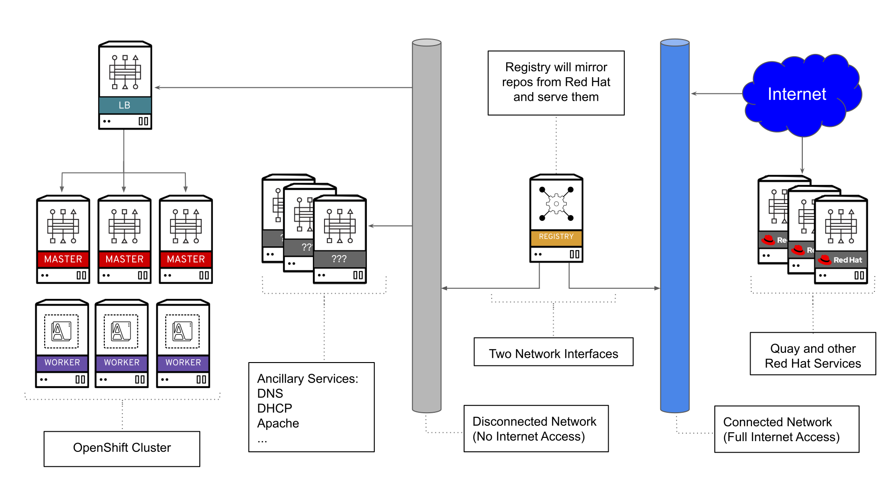

# OpenShift 4.2 Disconnected Install Preview

In a [previous blog](https://blog.openshift.com/introducing-red-hat-openshift-4-2-in-developer-preview-releasing-nightly-builds/), it was announced that Red Hat was releasing the OpenShift nightly builds. This gives users a chance to test up coming features. One of the features is the ability to perform a "disconnected" or "airgapped" install. This type of install let's you install OpenShift 4, in an environment without access to the internet or is otherwise restricted.

**NOTE, that nightly builds are unsupported and are for testing purposes only**

In this blog I will be going over how to perform a disconnected install in a lab environmet. I will also give an overview of my environment, how to mirror the needed images, and any other tips and tricks I've learned along the way.

## Environment Overview

In my environment, I have two networks. One network is completley disconnected; and has no access to the internet. The other network is connected to the internet and has full access. I will use a "bastion" host that has access to both networks. This bastion host will perform the following functions.

* Registry server (where I will mirror the content)
* Apache webserver (where I will store installation artifacts)
* Installation host (where I will be performing the installation from)

Here is a high-level overview of the environment I'll be working on.



In my environment, I have already set up DNS, DHCP, and other ancillary services for my network. Also, it's important to get familiar with the [OpenShift 4 prerequisites](https://docs.openshift.com/container-platform/4.1/installing/installing_bare_metal/installing-bare-metal.html#installation-infrastructure-user-infra_installing-bare-metal) before attempting an install.

Doing a disconnected install can be challenging, so I recommend trying a [fully connected OpenShift 4 install](https://blog.openshift.com/openshift-4-bare-metal-install-quickstart/) first to familiarize yourself with the install process (as they are quite similar).

### Registry Set Up

You can use your own registry or build one from scratch. I used the following steps to build one from scratch. Since I'll be using a container for my registry, and Apache for my webserver, I will need `podman`  and `httpd` on my host.

```shell
yum -y install podman httpd httpd-tools
```

Create the directories you'll need to run the registry. These directories will be mounted in the container running the registry.

```shell
mkdir -p /opt/registry/{auth,certs,data}
```

Next, Generate self-signed certificate (I'll be using `registry.ocp4.example.com` as my hostname. Make sure your hostname is in DNS and resolves to the correct IP)

```shell
cd /opt/registry/certs
openssl req -newkey rsa:4096 -nodes -sha256 -keyout domain.key -x509 -days 365 -out domain.crt
```

Generate username and password (must use bcrpt formated passwords), for access to your registry.

```shell
htpasswd -bBc /opt/registry/auth/htpasswd dummy dummy
```

Make sure to open port 5000 on your host, as this is the default port for the registry. Since I am using Apache to stage the files I need for installation, I will open port 80 as well.

```shell
firewall-cmd --add-port=5000/tcp --zone=internal --permanent
firewall-cmd --add-port=5000/tcp --zone=public   --permanent
firewall-cmd --add-service=http  --permanent
firewall-cmd --reload
```

Now you're ready to run the container. Here I specify the directories I want to mount inside the container. I also specify I want to run on port 5000. I recommend you put this in a shell script for ease of starting.

```shell
podman run --name poc-registry -p 5000:5000 \
-v /opt/registry/data:/var/lib/registry:z \
-v /opt/registry/auth:/auth:z \
-e "REGISTRY_AUTH=htpasswd" \
-e "REGISTRY_AUTH_HTPASSWD_REALM=Registry" \
-e "REGISTRY_HTTP_SECRET=ALongRandomSecretForRegistry" \
-e REGISTRY_AUTH_HTPASSWD_PATH=/auth/htpasswd \
-v /opt/registry/certs:/certs:z \
-e REGISTRY_HTTP_TLS_CERTIFICATE=/certs/domain.crt \
-e REGISTRY_HTTP_TLS_KEY=/certs/domain.key \
docker.io/library/registry:2
```

Verify connectivity to your registry with `curl`. Provide it the `username` and `password` you created.

```shell
curl -u dummy:dummy -k https://registry.ocp4.example.com:5000/v2/_catalog
```

> Note, this should return an "empty" repo

If you have issues connecting try and stop the container.

```shell
podman stop poc-registry
```

Once it's down you can start it back up using the same `podman run` command as before.

### Obtaining Artifacts

You will need the preview builds for 4.2 in order to do a disconnected install. Specifically, you will need the client binaries along with the install artifacts. This can be found in the dev preview links provided below.

* [Client Binaries](https://mirror.openshift.com/pub/openshift-v4/clients/ocp-dev-preview/latest/)
* [Install Artifacts](https://mirror.openshift.com/pub/openshift-v4/dependencies/rhcos/pre-release/latest/)

Download the binaries and any installation artifacts you may need for the installation. The file names will differ depending on when you chose to download the preview builds (they get updated often).

To download the client binaries to your staging server/area (in my case, it's the registry server itself) use `curl`:

```shell
curl https://mirror.openshift.com/pub/openshift-v4/clients/ocp-dev-preview/latest/openshift-client-linux-${BUILDNUMBER}.tar.gz -o /var/www/html/
curl https://mirror.openshift.com/pub/openshift-v4/clients/ocp-dev-preview/latest/openshift-install-linux-${BUILDNUMBER}.tar.gz -o /var/www/html/
```

You'll also need these clients on your registry host, so feel free to un-tar them now.

```shell
tar -xzf /var/www/html/openshift-client-linux-${BUILDNUMBER}.tar.gz -C /usr/local/bin/
tar -xzf /var/www/html/openshift-install-linux-${BUILDNUMBER}.tar.gz -C /usr/local/bin/
```

Depending on what kind of install you will do, you would need to do one of the following.

#### PXE Install

If you're doing a PXE install, you'll need the bios, initramfs, and the kernel files.

```shell
curl https://mirror.openshift.com/pub/openshift-v4/dependencies/rhcos/pre-release/latest/rhcos-${BUILDNUMBER}-metal-bios.raw.gz -o /var/www/html/
curl https://mirror.openshift.com/pub/openshift-v4/dependencies/rhcos/pre-release/latest/rhcos-${BUILDNUMBER}-installer-initramfs.img -o /var/www/html/
curl https://mirror.openshift.com/pub/openshift-v4/dependencies/rhcos/pre-release/latest/rhcos-${BUILDNUMBER}-installer-kernel -o /var/www/html/
```

Once you have staged these, copy them over into your environment. Once they are in your PXE install server and your configuration updated, you can proceed to mirror your images.

#### ISO Install

If you're doing an ISO install, you'll still need the bios file but only the ISO for the install.

```shell
curl https://mirror.openshift.com/pub/openshift-v4/dependencies/rhcos/pre-release/latest/rhcos-${BUILDNUMBER}-metal-bios.raw.gz -o /var/www/html/
curl https://mirror.openshift.com/pub/openshift-v4/dependencies/rhcos/pre-release/latest/rhcos-${BUILDNUMBER}-installer.iso -o /var/www/html/
```

Once these are staged, copy them over where you'll need them for the installation. The bios file will need to be on a webserver accessable to the OpenShift cluster. The ISO can be burned into a disk/usb drive or mounted via your virtualization platform.

Once that's done, you can proceed to mirror your images.


### Mirroring Images

The installation images will need to be mirrored in order to complete the installation. Before you begin you need to make sure you have the following in place.

* An internal registry to mirror the images to (like the one I just built)
  * You'll also need the certificate of this registry
  * The username/password for access
* A pullsecret obtained at [try.openshift.com](https://cloud.redhat.com/openshift/install/pre-release)
  * I downloaded mine and saved it as `~/pull-secret.json`
* The `oc` and `openshift-install` cli tools installed
* The `jq` command is also helpful

First, you will need to get the information to mirror. This information can be obtained via the dev-preview [release notes](https://mirror.openshift.com/pub/openshift-v4/clients/ocp-dev-preview/latest/release.txt). With this information, I constructed the following environment variables.

```
export OCP_RELEASE="4.2.0-0.nightly-2019-08-29-062233"
export AIRGAP_REG='registry.ocp4.example.com:5000'
export AIRGAP_REPO='ocp4/openshift4'
export UPSTREAM_REPO='openshift-release-dev'   ## or 'openshift'
export AIRGAP_SECRET_JSON='~/pull-secret-2.json'
export OPENSHIFT_INSTALL_RELEASE_IMAGE_OVERRIDE=${AIRGAP_REG}/${AIRGAP_REPO}:${OCP_RELEASE}
export RELEASE_NAME="ocp-release-nightly"
```

I will go over how to constructed these environment variables from the [release notes](https://mirror.openshift.com/pub/openshift-v4/clients/ocp-dev-preview/latest/release.txt)

* `OCP_RELEASE` - Can be obtained by the `Release Metadata.Version` section of the release page.
* `AIRGAP_REG` - This is your registry's hostname with port
* `AIRGAP_REPO` - This is the name of the repo in your registry (you don't have to create it beforehand)
* `UPSTREAM_REPO` - Can be obtianed from the `Pull From` section of the release page.
* `AIRGAP_SECRET_JSON` - This is the path to your pull secret  with your registry's information (which we will create later)
* `OPENSHIFT_INSTALL_RELEASE_IMAGE_OVERRIDE` - This environment variable is set so the installer knows to use your registry.
* `RELEASE_NAME` - This can be obtained in the `Pull From` section of the release page.

Before you can mirror the images, you'll need to add the authentication for your registy in your pull secret file (the one you got from [try.openshift.com](https://try.openshift.com)). This will look like this...

```json
{
	"registry.ocp4.example.com:5000":
		{
			"auth": "ZHVtbXk6ZHVtbXk=",
			"email": "noemail@localhost"
		}
}
```

The base64 is a construction of the registry's auth in the `username:password` format. For example, with the username of `dummy` and password of `dummy`; I created the base64 by running...

```shell
echo -n 'dummy:dummy' | base64 -w0
```

You can your pull secret with your registry information by using `jq` and the pull secret you downloaded.

```shell
jq '.auths += {"registry.ocp4.example.com:5000": {"auth": "ZHVtbXk6ZHVtbXk=","email": "noemail@localhost"}}' < ~/pull-secret.json > ~/pull-secret-2.json
```

Also, if you haven't done so already, make sure you trust your own self signed certifiacte. This is neeeded in order for `oc` to be able to login to your registry during the mirror process.

```shell
cp /opt/registry/certs/domain.crt /etc/pki/ca-trust/source/anchors/
update-ca-trust extract
```

With this in place, you can mirror the images with the following command.

```shell
oc adm release mirror -a ${AIRGAP_SECRET_JSON} \
--from=quay.io/${UPSTREAM_REPO}/${RELEASE_NAME}:${OCP_RELEASE} \
--to=${AIRGAP_REG}/${AIRGAP_REPO} --to-release-image=${AIRGAP_REG}/${AIRGAP_REPO}:${OCP_RELEASE}
```

Part of the output will have an example `imageContentSources` to put in your `install-config.yaml` file. It'll look something like this.

```yaml
imageContentSources:
- mirrors:
  - registry.ocp4.example.com:5000/ocp4/openshift4
  source: quay.io/openshift-release-dev/ocp-release-nightly
- mirrors:
  - registry.ocp4.example.com:5000/ocp4/openshift4
  source: quay.io/openshift-release-dev/ocp-v4.0-art-dev
```

Save this output, as you'll need it later

## Installation

At this point you can proceed with the normal installation procedure, with a few differences. Please refer to the [official documentation](https://docs.openshift.com/container-platform/4.1/welcome/index.html) for specific installation information. You're most likely doing a Bare Metal install, so my [previous blog](https://blog.openshift.com/openshift-4-bare-metal-install-quickstart/) would be helpful to look over as well.

I will be going over the installation at a high level.

### Create Ignition Config

You need to provide an `install-config.yaml` file when you create your ignition config. Here is an example for a disconnected install.

```yaml
apiVersion: v1
baseDomain: example.com
compute:
- hyperthreading: Enabled
  name: worker
  replicas: 0
controlPlane:
  hyperthreading: Enabled
  name: master
  replicas: 3
metadata:
  name: ocp4
networking:
  clusterNetworks:
  - cidr: 10.254.0.0/16
    hostPrefix: 24
  networkType: OpenShiftSDN
  serviceNetwork:
  - 172.30.0.0/16
platform:
  none: {}
pullSecret: '{"auths":{"registry.ocp4.example.com:5000": {"auth": "ZHVtbXk6ZHVtbXk=","email": "noemail@localhost"}}}'
sshKey: 'ssh-rsa .... root@helper'
additionalTrustBundle: |
  -----BEGIN CERTIFICATE-----
  ZZZZZZZZZZZZZZZZZZZZZZZZZZZZZZZZZZZZZZZZZZZZZZZZZZZZZZZZZZZZZZZZ
  -----END CERTIFICATE-----
imageContentSources:
- mirrors:
  - registry.ocp4.example.com:5000/ocp4/openshift4
  source: quay.io/openshift-release-dev/ocp-release-nightly
- mirrors:
  - registry.ocp4.example.com:5000/ocp4/openshift4
  source: quay.io/openshift-release-dev/ocp-v4.0-art-dev
```

Some things to note here:

* `pullSecret` - only the information about your registry is needed.
* `sshKey` - the contents of your `id_rsa.pub` file (or another ssh public key that you want to use)
* `additionalTrustBundle` - this is your crt file for your registry. (i.e. the output of `cat domain.crt`)
* `imageContentSources` -  What is the local registry is and the expected original source that should be in the metadata (otherwise they should be considered as tampered)

You will also need to export the `OPENSHIFT_INSTALL_RELEASE_IMAGE_OVERRIDE` environment variable. This tells OpenShift which image to use for bootstraping. This is in the form of `${AIRGAP_REG}/${AIRGAP_REPO}:${OCP_RELEASE}`. It looked like this in my environment.

```
export OPENSHIFT_INSTALL_RELEASE_IMAGE_OVERRIDE=registry.ocp4.example.com:5000/ocp4/openshift4:4.2.0-0.nightly-2019-08-29-062233
```

I created my `install-config.yaml` under the `/root/ocp4` directory. At this point you can create your ignition configs

```
openshift-install create ignition-configs --dir=/root/ocp4
INFO Consuming "Install Config" from target directory 
WARNING Making control-plane schedulable by setting MastersSchedulable to true for Scheduler cluster settings 
WARNING Found override for ReleaseImage. Please be warned, this is not advised 
```

Please note that it warns you about overriding the image and that for 4.2 dev preview, and that the masters are schedulable.

Make sure to copy the ignition files to your webserver for the installation

```
cp /root/ocp4/*.ign /var/www/html/ignition/
restorecon -vR /var/www/html/
```

### Install Nodes

You can now boot your servers to do the installation. Whether you are doing PXE or ISO install, you will need to provide some options in the boot screen. When you see the following screen, press `Tab`


You'll enter the following (**ALL IN ONE LINE**); this is an example of my boostrap node.

```
coreos.inst.install_dev=vda
coreos.inst.image_url=http://172.16.2.77/rhcos-4.1.0-x86_64-metal-bios.raw.gz
coreos.inst.ignition_url=http://172.16.2.77/ignition/bootstrap.ign
```

Here is an explanation of the RHCOS options:

* `coreos.inst.install_dev` - The block device which RHCOS will install to.
* `coreos.inst.image_url` - The URL of the UEFI or BIOS image that you uploaded to the web server.
* `coreos.inst.ignition_url` - The URL of the Ignition config file for this machine type.

Perform the same procedure for your Masters and Workers as well.

### Bootstrap

Just like a normal install you wait for the boostrap step to finish (once you booted and installed the boostrap, master, and worker nodes)

```
openshift-install wait-for bootstrap-complete --dir=/root/ocp4 --log-level debug
```

You will see the output similar to this.

```
DEBUG OpenShift Installer v4.2.0-201908282219-dirty 
DEBUG Built from commit 4f3e73a0143ba36229f42e8b65b6e65342bb826b 
INFO Waiting up to 30m0s for the Kubernetes API at https://api.ocp4.example.com:6443... 
INFO API v1.14.0+a91f2ac up                       
INFO Waiting up to 30m0s for bootstrapping to complete... 
DEBUG Bootstrap status: complete                   
INFO It is now safe to remove the bootstrap resources 
```

Once you see that message, you can delete/repurpose the bootstrap node.

### Finishing up

Export your `KUBECONFIG` environment variable to connect to your cluster

```
export KUBECONFIG=/root/ocp4/auth/kubeconfig
```

You will need to set your image registry to use some sort of storage. You can assign a PV or use object storage. For testing, I will use `emptyDir` (**NOTE** doing this makes the storage for your images ephemeral)

```
oc patch configs.imageregistry.operator.openshift.io cluster --type merge --patch '{"spec":{"storage":{"emptyDir":{}}}}'
```

Check the status of your nodes

```
oc get nodes
```

If any say `NotReady`; you may have to approve the CSR. View what's pending with `oc get csr`, you can also approve all of them at once with the following command.

```
oc get csr --no-headers | awk '{print $1}' | xargs oc adm certificate approve
```

Once you've approved any pending node CSRs and you've set the storage for your registry, you can finish up the install.

```
openshift-install wait-for install-complete --dir=/root/ocp4
```

Once you see this output, you're done with the installation

```
INFO Waiting up to 30m0s for the cluster at https://api.ocp4.example.com:6443 to initialize... 
INFO Waiting up to 10m0s for the openshift-console route to be created... 
INFO Install complete!                            
INFO To access the cluster as the system:admin user when using 'oc', run 'export KUBECONFIG=/root/ocp4/auth/kubeconfig' 
INFO Access the OpenShift web-console here: https://console-openshift-console.apps.ocp4.example.com 
INFO Login to the console with user: kubeadmin, password: JZEGE-akpeR-vpXbU-KbFbn 
```

View the cluster version

```
oc get clusterversion
NAME      VERSION                             AVAILABLE   PROGRESSING   SINCE   STATUS
version   4.2.0-0.nightly-2019-08-29-062233   True        False         3m57s   Cluster version is 4.2.0-0.nightly-2019-08-29-062233
```

## Conclusion

In this blog, I went over how you can prepare for a disconnected install and how to perform a disconnected install using the nightly developer preview of OpenShift 4. Disconnected installs was a highly popular request for OpenShift 4, and we are excited to bring you a preview build.

Nightly builds are a great way to preview what's up and coming with OpenShift, so you can test things before the GA release. We are excited to bring you this capability and hope that you find it useful. If you have any questions or comments, feel free to use the comment section below!
