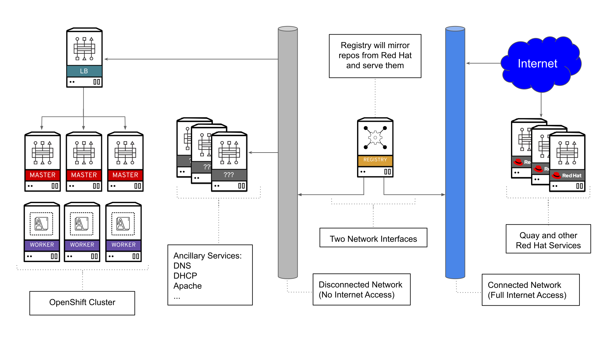

# OpenShift 4.2 Restricted Network Installs

In a [previous blog](https://blog.openshift.com/introducing-red-hat-openshift-4-2-in-developer-preview-releasing-nightly-builds/), it was announced that Red Hat is making  the OpenShift nightly builds available to everyone. This gives users a chance to test upcoming features before the general availability. One of the features planned for OpenShift 4.2 is the ability to perform an install on restricted networks, allowing you to install on an environment with limited access to the internet or otherwise restricted.

**NOTE: OCP 4.2 has been released and official documentation can be found [here](https://docs.openshift.com/container-platform/4.2/installing/installing_restricted_networks/installing-restricted-networks-preparations.html)**

In this blog I will be going over how to perform an install in a lab environment with limited access to the internet. I will also give an overview of my environment, how to mirror the needed images, and any other tips and tricks I've learned along the way.

## Environment Overview

In my environment, I have two networks. One network has limited access to the internet. The other network is connected to the internet and has full access. I will use a bastion host that has access to both networks. This bastion host will perform the following functions.

* Registry server (where I will mirror the content)
* Apache web server (where I will store installation artifacts)
* Installation host (where I will be performing the installation from)

Here is a high-level overview of the environment I'll be working on.



In my environment, I have already set up DNS, DHCP, and other ancillary services for my network. Also, it's important to get familiar with the [OpenShift 4 prerequisites](https://docs.openshift.com/container-platform/4.2/installing/installing_bare_metal/installing-bare-metal.html#installation-infrastructure-user-infra_installing-bare-metal) before attempting an install.


Doing an install on a restricted network can be challenging, so I recommend trying a [fully connected OpenShift 4 install](https://blog.openshift.com/openshift-4-bare-metal-install-quickstart/) first to familiarize yourself with the install process (as they are quite similar).

## Registry Set Up

You can use your own registry or build one from scratch. I used the following steps to build one from scratch. Since I'll be using a container for my registry, and Apache for my webserver, I will need podman and httpd on my host.

```shell
yum -y install podman httpd httpd-tools
```

Create the directories you'll need to run the registry. These directories will be mounted in the container running the registry.

```shell
mkdir -p /opt/registry/{auth,certs,data}
```

Next, generate an SSL certificate for the registry.  This can, optionally, be self-signed if you don't have an existing, trusted, certificate authority. I'll be using `registry.ocp4.example.com` as the hostname for my registry. Make sure your hostname is in DNS and resolves to the correct IP.

```shell
cd /opt/registry/certs
openssl req -newkey rsa:4096 -nodes -sha256 -keyout domain.key -x509 -days 365 -out domain.crt
```

Generate username and password (must use `bcrypt` formatted passwords), for access to your registry.

```shell
htpasswd -bBc /opt/registry/auth/htpasswd dummy dummy
```

Make sure to open port `5000` on your host, as this is the default port for the registry. Since I am using Apache to stage the files I need for installation, I will open port `80` as well.

```shell
firewall-cmd --add-port=5000/tcp --zone=internal --permanent
firewall-cmd --add-port=5000/tcp --zone=public   --permanent
firewall-cmd --add-service=http  --permanent
firewall-cmd --reload
```

Now you're ready to run the container. Here I specify the directories I want to mount inside the container. I also specify I want to run on port `5000`. I recommend you put this in a shell script for ease of starting.

```shell
podman run --name poc-registry -p 5000:5000 \
-v /opt/registry/data:/var/lib/registry:z \
-v /opt/registry/auth:/auth:z \
-e "REGISTRY_AUTH=htpasswd" \
-e "REGISTRY_AUTH_HTPASSWD_REALM=Registry" \
-e "REGISTRY_HTTP_SECRET=ALongRandomSecretForRegistry" \
-e REGISTRY_AUTH_HTPASSWD_PATH=/auth/htpasswd \
-v /opt/registry/certs:/certs:z \
-e REGISTRY_HTTP_TLS_CERTIFICATE=/certs/domain.crt \
-e REGISTRY_HTTP_TLS_KEY=/certs/domain.key \
docker.io/library/registry:2
```

Verify connectivity to your registry with `curl`. Provide it the `username` and `password` you created.

```shell
curl -u dummy:dummy -k https://registry.ocp4.example.com:5000/v2/_catalog
```

> Note, this should return an "empty" repo

If you have issues connecting try and stop the container.

```shell
podman stop poc-registry
```

Once it's down you can start it back up using the the following `podman` command:

```shell
podman start poc-registry
```

## Obtaining Artifacts

You will need the preview builds for 4.2 in order to do a network restricted install. Specifically, you will need the client binaries along with the install artifacts. This can be found in the dev preview links provided below.

* [Client Binaries](https://mirror.openshift.com/pub/openshift-v4/clients/ocp-dev-preview/latest/)
* [Install Artifacts](https://mirror.openshift.com/pub/openshift-v4/dependencies/rhcos/pre-release/latest/)

Download the binaries and any installation artifacts you may need for the installation. The file names will differ depending on when you choose to download the preview builds (they get updated often).

You can inspect the [nightly release notes](https://mirror.openshift.com/pub/openshift-v4/clients/ocp-dev-preview/latest/release.txt) and extract the build number you need from there. I did this with the `curl` command.

```
export BUILDNUMBER=$(curl -s https://mirror.openshift.com/pub/openshift-v4/clients/ocp-dev-preview/latest/release.txt | grep 'Name:' | awk '{print $NF}')
```
To download the client binaries to your staging server/area (in my case, it's the registry server itself) use `wget`:

```shell
wget https://mirror.openshift.com/pub/openshift-v4/clients/ocp-dev-preview/latest/openshift-client-linux-${BUILDNUMBER}.tar.gz -P /var/www/html/
wget https://mirror.openshift.com/pub/openshift-v4/clients/ocp-dev-preview/latest/openshift-install-linux-${BUILDNUMBER}.tar.gz -P /var/www/html/
```

You'll also need these clients on your registry host, so feel free to un-tar them now.

```shell
tar -xzf /var/www/html/openshift-client-linux-${BUILDNUMBER}.tar.gz -C /usr/local/bin/
tar -xzf /var/www/html/openshift-install-linux-${BUILDNUMBER}.tar.gz -C /usr/local/bin/
```

Depending on what kind of install you will do, you would need to do one of the following.

### PXE Install

If you're doing a PXE install, you'll need the BIOS, initramfs, and the kernel files.

```shell
wget https://mirror.openshift.com/pub/openshift-v4/dependencies/rhcos/pre-release/latest/rhcos-${BUILDNUMBER}-metal-bios.raw.gz -P /var/www/html/
wget https://mirror.openshift.com/pub/openshift-v4/dependencies/rhcos/pre-release/latest/rhcos-${BUILDNUMBER}-installer-initramfs.img -P /var/www/html/
wget https://mirror.openshift.com/pub/openshift-v4/dependencies/rhcos/pre-release/latest/rhcos-${BUILDNUMBER}-installer-kernel -P /var/www/html/
```

Once you have staged these, copy them over into your environment. Once they are in your PXE install server and your configuration updated, you can proceed to mirror your images.

### ISO Install

If you're doing an ISO install, you'll still need the BIOS file but only the ISO for the install.

```shell
wget https://mirror.openshift.com/pub/openshift-v4/dependencies/rhcos/pre-release/latest/rhcos-${BUILDNUMBER}-metal-bios.raw.gz -P /var/www/html/
wget https://mirror.openshift.com/pub/openshift-v4/dependencies/rhcos/pre-release/latest/rhcos-${BUILDNUMBER}-installer.iso -P /var/www/html/
```

Once these are staged, copy them over to where you'll need them for the installation. The BIOS file will need to be on a web server accessible to the OpenShift nodes. The ISO can be burned into a disk/usb drive or mounted via your virtualization platform.

Once that's done, you can proceed to mirror the container images.


## Mirroring Images

The installation images will need to be mirrored in order to complete the installation. Before you begin you need to make sure you have the following in place.


* An internal registry to mirror the images to (like the one I just built)
  * You'll also need the certificate of this registry
  * The username/password for access
* A pullsecret obtained at [try.openshift.com](https://cloud.redhat.com/openshift/install/pre-release)
  * I downloaded mine and saved it as `~/pull-secret.json`
* The `oc` and `openshift-install` CLI tools installed
* The `jq` command is also helpful

First, you will need to get the information to mirror. This information can be obtained via the dev-preview [release notes](https://mirror.openshift.com/pub/openshift-v4/clients/ocp-dev-preview/latest/release.txt). With this information, I constructed the following environment variables.  

```
export OCP_RELEASE="4.2.0"
export LOCAL_REG='registry.ocp4.example.com:5000'
export LOCAL_REPO='ocp4/openshift4'
export UPSTREAM_REPO='openshift-release-dev'
export LOCAL_SECRET_JSON="${HOME}/pull-secret-2.json"
export OPENSHIFT_INSTALL_RELEASE_IMAGE_OVERRIDE=${LOCAL_REG}/${LOCAL_REPO}:${OCP_RELEASE}
export RELEASE_NAME="ocp-release"
```

I will go over how to construct these environment variables from the [release notes](https://mirror.openshift.com/pub/openshift-v4/clients/ocp-dev-preview/latest/release.txt)

* `OCP_RELEASE` - Can be obtained by the `Release Metadata.Version` section of the release page.
* `LOCAL_REG` - This is your registry's hostname with port
* `LOCAL_REPO` - This is the name of the repo in your registry (you don't have to create it beforehand)
* `UPSTREAM_REPO` - Can be obtianed from the `Pull From` section of the release page.
* `LOCAL_SECRET_JSON` - This is the path to your pull secret  with your registry's information (which we will create later)
* `OPENSHIFT_INSTALL_RELEASE_IMAGE_OVERRIDE` - This environment variable is set so the installer knows to use your registry.
* `RELEASE_NAME` - This can be obtained in the `Pull From` section of the release page.

Before you can mirror the images, you'll need to add the authentication for your registry in your pull secret file (the one you got from [try.openshift.com](https://try.openshift.com)). This will look like this:

```json
{
	"registry.ocp4.example.com:5000":
		{
			"auth": "ZHVtbXk6ZHVtbXk=",
			"email": "noemail@localhost"
		}
}
```

The base64 is a construction of the registry's auth in the `username:password` format. For example, with the username of `dummy` and password of `dummy`; I created the base64 by running:

```shell
echo -n 'dummy:dummy' | base64 -w0
```

You can add your registry's information to your pull secret by using `jq` and the pull secret you downloaded (thus creating a new pull secret file with your registry's information).

```shell
jq '.auths += {"registry.ocp4.example.com:5000": {"auth": "ZHVtbXk6ZHVtbXk=","email": "noemail@localhost"}}' < ~/pull-secret.json > ~/pull-secret-2.json
```

Also, if needed and you haven't done so already, make sure you trust the self-signed certificate. This is needed in order for oc to be able to login to your registry during the mirror process.

```shell
cp /opt/registry/certs/domain.crt /etc/pki/ca-trust/source/anchors/
update-ca-trust
```

With this in place, you can mirror the images with the following command.

```shell
oc adm release mirror -a ${LOCAL_SECRET_JSON} \
--from=quay.io/${UPSTREAM_REPO}/${RELEASE_NAME}:${OCP_RELEASE} \
--to=${LOCAL_REG}/${LOCAL_REPO} --to-release-image=${LOCAL_REG}/${LOCAL_REPO}:${OCP_RELEASE}
```

Part of the output will have an example `imageContentSources` to put in your `install-config.yaml` file. It'll look something like this.

```yaml
imageContentSources:
- mirrors:
  - registry.ocp4.example.com:5000/ocp4/openshift4
  source: quay.io/openshift-release-dev/ocp-release-nightly
- mirrors:
  - registry.ocp4.example.com:5000/ocp4/openshift4
  source: quay.io/openshift-release-dev/ocp-v4.0-art-dev
```

Save this output, as you'll need it later

## Installation

At this point you can proceed with the normal installation procedure, with the main difference being what you specify in the `install-config.yaml` file when you create the ignition configs. 

Please refer to the [official documentation](https://docs.openshift.com/container-platform/4.2/welcome/index.html) for specific installation information. You're most likely doing a Bare Metal install, so my [previous blog](https://blog.openshift.com/openshift-4-bare-metal-install-quickstart/) would be helpful to look over as well.

When creating an `install-config.yaml` file, you need to specify additional parameters like the example below.

```yaml
apiVersion: v1
baseDomain: example.com
compute:
- hyperthreading: Enabled
  name: worker
  replicas: 0
controlPlane:
  hyperthreading: Enabled
  name: master
  replicas: 3
metadata:
  name: ocp4
networking:
  clusterNetworks:
  - cidr: 10.254.0.0/16
    hostPrefix: 24
  networkType: OpenShiftSDN
  serviceNetwork:
  - 172.30.0.0/16
platform:
  none: {}
pullSecret: '{"auths":{"registry.ocp4.example.com:5000": {"auth": "ZHVtbXk6ZHVtbXk=","email": "noemail@localhost"}}}'
sshKey: 'ssh-rsa .... root@helper'
additionalTrustBundle: |
  -----BEGIN CERTIFICATE-----
  ZZZZZZZZZZZZZZZZZZZZZZZZZZZZZZZZZZZZZZZZZZZZZZZZZZZZZZZZZZZZZZZZ
  -----END CERTIFICATE-----
imageContentSources:
- mirrors:
  - registry.ocp4.example.com:5000/ocp4/openshift4
  source: quay.io/openshift-release-dev/ocp-release-nightly
- mirrors:
  - registry.ocp4.example.com:5000/ocp4/openshift4
  source: quay.io/openshift-release-dev/ocp-v4.0-art-dev
```

Some things to note here:

* `pullSecret` - only the information about your registry is needed.
* `sshKey` - the contents of your `id_rsa.pub` file (or another ssh public key that you want to use)
* `additionalTrustBundle` - this is your crt file for your registry. (i.e. the output of `cat domain.crt`)
* `imageContentSources` -  What is the local registry is and the expected original source that should be in the metadata (otherwise they should be considered as tampered)

You will also need to export the `OPENSHIFT_INSTALL_RELEASE_IMAGE_OVERRIDE` environment variable. This tells OpenShift which image to use for bootstraping. This is in the form of `${LOCAL_REG}/${LOCAL_REPO}:${OCP_RELEASE}`. It looked like this in my environment.

```shell
export OPENSHIFT_INSTALL_RELEASE_IMAGE_OVERRIDE=registry.ocp4.example.com:5000/ocp4/openshift4:4.2.0-0.nightly-2019-08-29-062233
```

I created my `install-config.yaml` under the `/root/ocp4` directory. At this point you can create your manifests

```shell
$ openshift-install create ignition-configs --dir=/root/ocp4
```

Modify the `/root/ocp4/manifests/cluster-scheduler-02-config.yml` manifest file to prevent Pods from being scheduled on the control plane machines by editing the file and setting `mastersSchedulable` parameter to `flase`.


Now, create your ignition configs

```shell
$ openshift-install create ignition-configs --dir=/root/ocp4
INFO Consuming "Install Config" from target directory 
WARNING Making control-plane schedulable by setting MastersSchedulable to true for Scheduler cluster settings 
WARNING Found override for ReleaseImage. Please be warned, this is not advised 
```

Please note that it warns you about overriding the image and that for the 4.2 dev preview, that the masters are schedulable.

At this point, you can proceed with the installation [as you would normally](https://docs.openshift.com/container-platform/4.2/installing/installing_bare_metal/installing-bare-metal.html#installation-generate-ignition-configs_installing-bare-metal).

## Troubleshooting

A good thing to do during the bootstrapping process is to login to the bootstrap server and tail the journal logs as the bootstrapping process progresses. Many errors or misconfigurations can be seen immediately when tailing this log.

```shell
[core@bootstrap ~]$ journalctl -b -f -u bootkube.service
```

There are times where you might have to approve the worker/master node's CSR. You can check pending CSRs with the `oc get csr` command.This is important to check since the cluster operators won't finish without any worker nodes added.

You can approve all the pending CSRs in one shot with the following command.

```shell
[user@bastion ~]$ oc get csr --no-headers | awk '{print $1}' | xargs oc adm certificate approve
```

After the bootstrap process is done, it's helpful to see your cluster operators running. You can do this with the `oc get co` command. It's helpful to have this in a watch in a separate window

```shell
[user@bastion ~]$ watch oc get co
```

The two most common issues is that the `openshift-install` command is waiting for the `image-registry` and `ingress` to come up before it considers the install a success. Make sure you've [approved the CSRs for your machines](https://docs.openshift.com/container-platform/4.2/installing/installing_bare_metal/installing-bare-metal.html#installation-approve-csrs_installing-bare-metal) and you've [configured storage for your image-registry](https://docs.openshift.com/container-platform/4.2/installing/installing_bare_metal/installing-bare-metal.html#installation-registry-storage-config_installing-bare-metal).

The commands I've provided should help you navigate any issues you may have.

## Conclusion

In this blog, I went over how you can prepare for a restricted network install and how to perform the install using the nightly developer preview of OpenShift 4. Restricted network installs was a highly popular request for OpenShift 4, and we are excited to bring you a preview build.

Nightly builds are a great way to preview what's up and coming with OpenShift, so you can test things before the GA release. We are excited to bring you this capability and hope that you find it useful. If you have any questions or comments, feel free to use the comment section below!  
